# RecursivePhoto

## Basic Description 
A Recursive Photo, more commonly known as a Photo Mosaic, is a photo made up from a lot of smaller photos. Check out this wikipedia [page](https://en.wikipedia.org/wiki/Photographic_mosaic) for more details! There are many different ways to create Recursive Photo and this repo explores a few of them. These ways are:
- [Recursive Photo v1](#recursive-photo-v1) - Creates a grayscale photo from a bunch of mini versions of itself. 

Original             |  Recursive Photo
:-------------------------:|:-------------------------:
  |  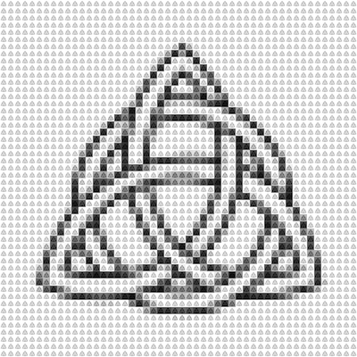

- [Recursive Photo v2](#recursive-photo-v2) - Create a grayscale photo from a library of a bunch of mini photos
  
Original             |  Recursive Photo
:-------------------------:|:-------------------------:
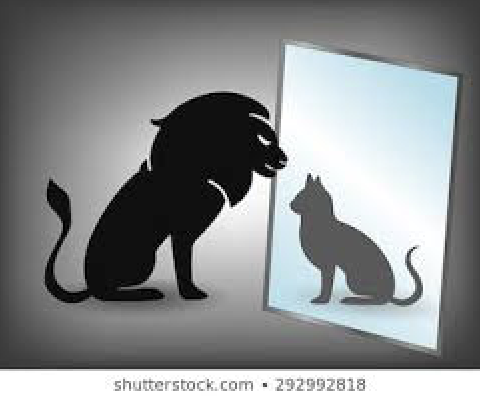  |  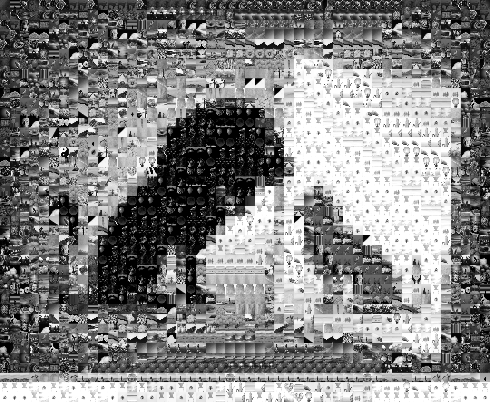

- [Recursive Photo v3](#recursive-photo-v3) - Create a color photo from a library of a bunch of mini photos

Original             |  Recursive Photo
:-------------------------:|:-------------------------:
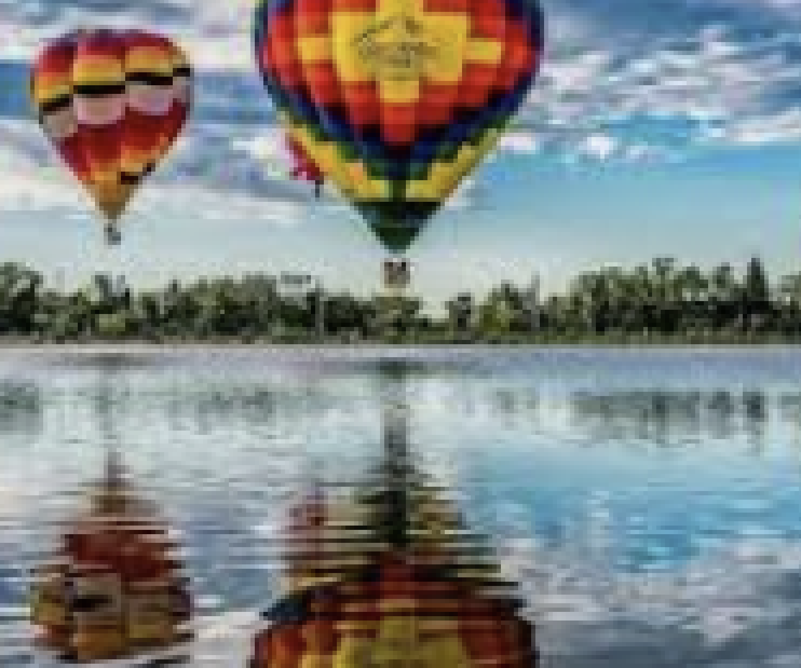  |  

- [Recursive Photo v4](#recursive-photo-v4) - Use content based image retrieval (CBIR) to more accurately create a grayscale photo from a library. 

Original             |  Recursive Photo
:-------------------------:|:-------------------------:
  |  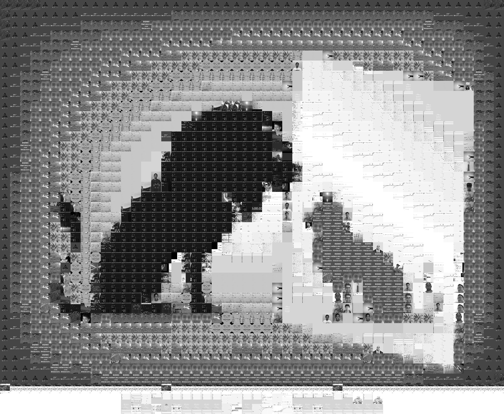

- [Recursive Photo v5](#recursive-photo-v5) - Use CBIR to more accurately create a color photo from a library

Original             |  Recursive Photo
:-------------------------:|:-------------------------:
  |  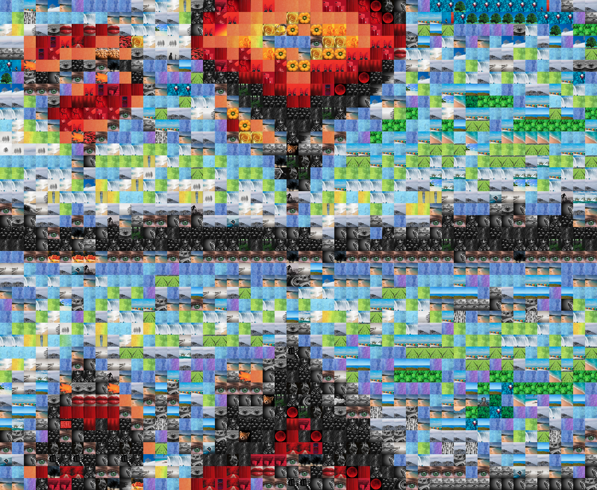
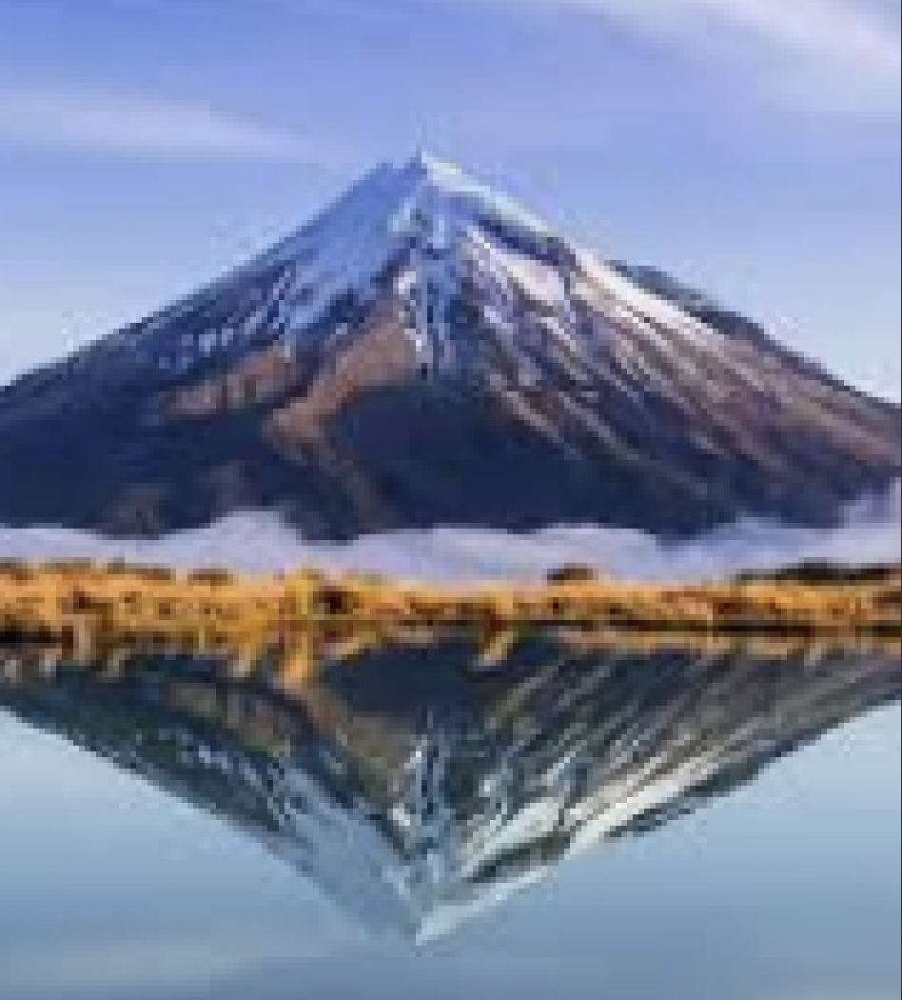  |  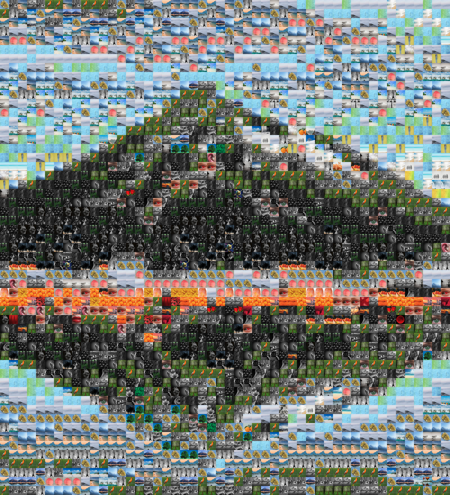
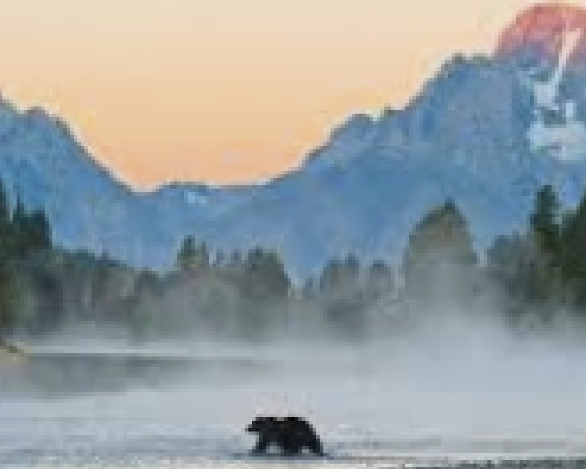  |  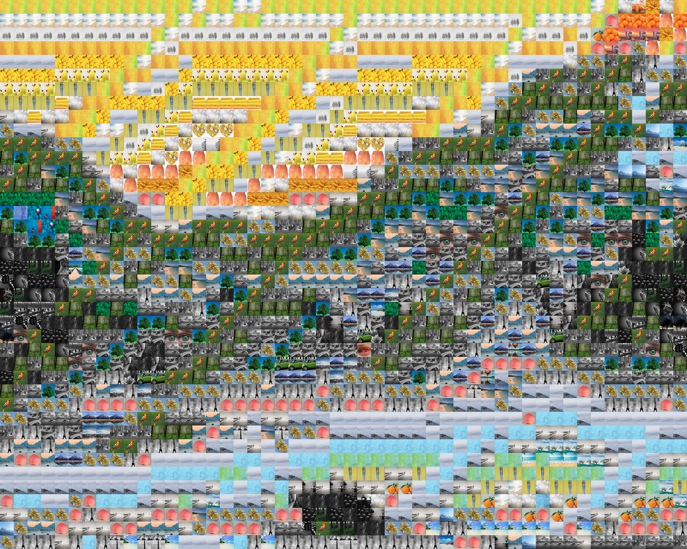
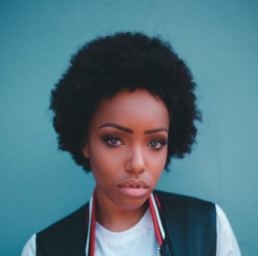  |  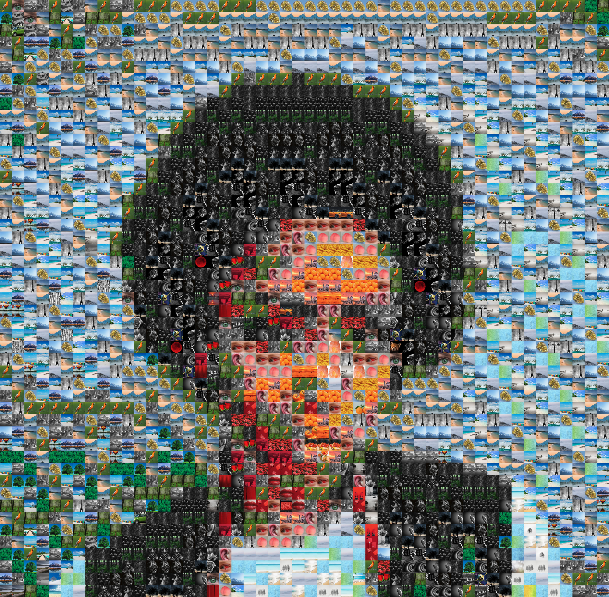

- [Recursive Video](#recursive-video) - Using recursive photo v1, create a video. Here's an [example](https://www.youtube.com/watch?v=8a0qNFAP2QI)

## Initial Setup
I'm running all on `python 3.7.7` (Previously on python 2, but has since been refactored. You can dig in the commit history to see python 2 versions). Follow these instructions to set everything up:

Create conda enviornment and install `requirements.txt`:
   ```zsh
   conda create -n recursivePhoto_env python=3.7.7
   conda activate recursivePhoto_env
   pip install -r requirements.txt
   ```
   Note: I used `recursivePhoto_env` as my environment name, but you can use anything.

That should be it! You should now be able to run `main.py` as described below.

## Usage
1. run `python main.py` then follow the prompts! Results should be saved into `results/` directory.

## Inspiration
That photo of Einstein at COSI that is like a RecursivePhoto 


## Fun
If you run this program on a photo, then take the result and run this program again, you get a doubly recursive photo. And then continue repeating! You may have to mess around with mini-photos per row and pixels per mini-photo to get interesting results.

## Recursive Photo V1

### Basic Description
Write program that take a photo and creates a new photo that is the original photo, except its pixel clusters are replaced with a tinted, resized version of the original photo. Another name for these are Photo Mosaics. Wikipedia has a  for this!

### Extensions
- Color photos
- Use scikit image for efficiency
- User can input thousands of their own photos, perhaps through a directory path the program processes these and recreates a color photo from these photos. 
  - program can format photos so they all have the same aspect ratio etc.
  - A smart way to do this may be to detect patterns within individual photos and use those to your advantage to form lines. But this seems out of my skill set for now...

## Recursive Photo V2

### Basic Description
This is a second attempt to create recursive photos, which digs into one of the extensions described above. The user inputs as many (or as few) of their own photos, and then a photo to recurse-ify. Then, the program spits out a recursive photo from that. This is much closer to the Einstein photo now! Note: everything is in black and white, and there are many things to improve!

### How it works
This program works by reading in a directory of photos, then resizing (not cropping--it actually distorts the photo) to be the same rough dimension as the photo that we're trying to recursify, and also turning the photo into black and white and assigning a gray scale value to each of those photos. From there, we assign gray scale values to each of block of the photo we're trying to recursify. Then, we look through our list of photos, and find the closest matching photo to a block, according to their gray scale values. We take that photo without replacement, "lift" it to better match the block's gray scale value, and stitch it into the final result, in the place of the block. Once (if) our list of photos is empty, we repopulate it. 

### Extensions/Experiments
- Try choosing photos *with* replacement, and see how that turns out (you may get repeated photos in a row, but that might be okay)
- Extend this to color photos
- Add a threshold for choosing photos for blocks (in the with replacement case), where if the difference in gray scales is too large, we repopulate the list of photos to hopefully get a closer match.
  - Update: I added this, and it really improves results (although it does make things slightly slower)
- Don't "lift" the photo to exactly match the block. I wonder what allowing such discrepancies will do (assuming we have a large photo library--this won't work well if we have a small photo library)
  - Update: With the addition of thresholding, this actually doesn't make much of a difference which is cool! Means that my recursive photos are "natural" unlike the the photoshop technique for photo mosaics / most techniques you find online!
- Add more sophisticated algorithm for selecting photos--one which ensures that no duplicated photos are nearby, possibly one which uses cv to detect and match features of sub-images to original image blocks.
- BIG: use correlation filter that cs237a taught to find best match images! This is big & does the feature matching which we desire!
   
### Experiments
I tried a variety of experiments of whether or not to lift (change color of) photos, and whether or not to threshold, and if thresholding, how much to threshold by. You can/should also play around with these in the code!

## Recursive photo v3

### Basic description
Attempt to use color photos and also not distort images when cropping and resizing.

### Challenges
Possibly a result of my photo library, but color images produced by this seem to lack the vivid colors of the original.
Update: the real reason the images lacked the vivid colors of the original is because I was using luminance, which isn't an accurate representation of color. 
How do we sort color images? Currently, I'm not sorting and so when I'm finding the closest image, I iterate over all images in the library, which seems ugly. This is difficult, because there doesn't seem to be a canonical way to compare colors. 

### Experiments
Initally, I used luminance as a measure of photo distance in order to compare photos. That didn't turn well, so I instead switched to using RGB distances as a measure of distance. 

## Recursive Photo v4

### Basic Description
This recursive photo iteration returns back to solving the B/W problem. However, we take a more nuanced approach. Instead of just focusing on the
average image gray scale value, we use content based image retrieval (CBIR) techniques, which are a family of techniques trying to solve the problem
of image similarity: given a target image and a library of images, CBIR attempts to find similar images in that library to the target. CBIR is not an easy 
problem to solve well--and that's why it's still being researched today. However, in order to produce results, I don't need state of the art CBIR. 
So I elected to implement a simple CBIR algorithm. My simple approach to CBIR uses the following technique

1. Find the top `N` closest images in the library to the target based on average gray scale value
2. Scale those `N` images down to a low resolution, and scale the target down to a low resolution
3. Compare pixel by pixel the `N` low res images to the low res target and select the library image that most resembles the target

It's simple to implement and relatively quick, which is great. 

Note: this program works differently from the other recursive photos in that you can create multiple recursive photos from the same loaded library (saves time--don't need to load library in multiple times)

### Challenges
- CBIR -- we want a fast CBIR, but also an effective one.
- Library -- your library of photos is especially important for this. Especially since the program doesn't do any gray scale lifting. And CBIR pattern matching
is only effective if there exist relatively closely matched patterns in the library. 
- Choosing the right parameters (resolution of low resolution images), what `N` should be (for `N` closest images), etc.

### Experiments
I performed a variety of experiments, trying different combinations of whether or not to chose with or without replacement (with replacement generates more accurate results, but it repeats many photos, which is undesirable), as well as different values for the many parameters involved in this. I also played around with different libraries, because the library's contents vastly impacts the closeness of matches which we will find. And interesting challenge for the future will be to create algorithms which can deal with bad libraries by identifying desirable regions within photos and then cropping photos so that only the desirable region is shown. 

### Thoughts
The attempt that used replacement is by far the most accurate. Because with replacement, we can always find the optimal choice in the library. The next iterations which didn't use replacement aren't as great, at least for the cat, and possibly worse than the V2 versions. I attribute this partially to my lack of a great library. Perhaps there is a different way to avoid repetition of images without forgoing the accuracy of replacement. 

I'm definitely interested to see what adding color will do to this.

## Recursive Photo v5

### Basic Description
The color version of Recursive Photo v4. Uses low res matching for better performance. 

### Challenges
Just as in Recursive Photo v3, comparing colors is a challenge

### Experiments
I tried with and without replacement. Without replacement seems to give more visually appealing and accurate (?) results. 

I think the results turned out pretty well--to me, they seem more precise than their v3 versions. Also, color versions of v4 photos seem to be much more well done, because in v4, since there is only grayscale, it's easy for colors and edges to blend together, but with color, these edges become more distinct. 

Added in ability for cropping of library photos to effectively extend a library (i.e. a library photo can be split into its four quarters, and each of
these quarters can become a sub photo of the final result). This creates more accurate images, at the cost of speed. Can be enabled/disabled by changing a flag.

### Thoughts
The main things I need to improve are to reduce the overall hackyness of my algo. I used a lot of shortcuts just to see if the final product would be interesting, so now it's time to go back and fix all of these. Specifically, there are a lot of static constants which I rely on, and I'd like to take these away, from better logic or abstraction and have dynamic constants that suit each photo better. Currently, the constants make for some ugly repeated photos / patterns of photos in the results.

## Recursive Video

### Basic description
Turn series of recursivePhotos into videos. Random, but though it would look cool. Here's an example: [creepy eye](https://www.youtube.com/watch?v=8a0qNFAP2QI)

## Resources
- [Pillow - Python Image Library](https://pillow.readthedocs.io/en/stable/) 
- [Scikit Image - More efficient image processing](https://scikit-image.org/)
- [Tutorial on how to do something similar in photoshop](https://www.youtube.com/watch?v=q0tt3VXhqkQ) - Although this is definitely not doing the same thing that RecursivePhoto is. 
- [Proper example](https://www.picturemosaics.com/true/) - this site is doing real photo mosaics, just like 
I want to!